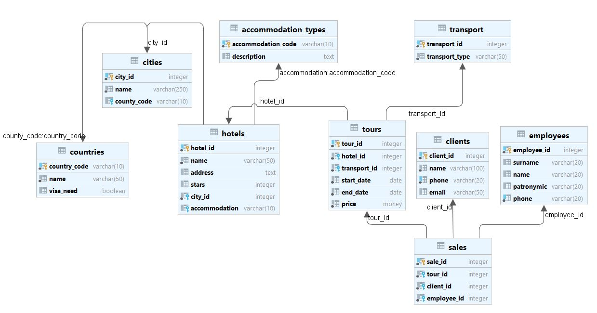

## Домашнее задание №4

-----------------------

#### Создание базы данных и схемы

[Скрипты создания базы и пользователей](../src/main/liquibase/updates/0_0/001_db_users.sql)

[Скрипты создания таблиц](../src/main/liquibase/updates/1_0/sql/20211118-U-1026.sql)

#### Создание ролей

| Роль | Обоснование |
|------|-------------|
|админ|администрирование базы|
|руководитель|заведение сотрудников, проверка статистики продаж|
|сотрудник|заведение/чтение клиентов, просмотр/редактирование туров|
|клиент|просмотр туров, создан как креденшал для доступа из бэка в бд|

[Скрипты выдачи прав](../src/main/liquibase/updates/0_0/002_grant.sql)

#### Полученная схема

#### Изменения со временем и по обстоятельствам:

Изменения связаны со следующими обстоятельствами:

- Из-за ковида потребовалось добавить поле, отвечающее за ковидные ограничения;
- Создан справочник ковидных ограничений;
- Обновление прав на чтение таблицы ковида;
- При росте 

[Скрипты обновления таблиц](../src/main/liquibase/updates/1_0/sql/20211223-U-1600.sql)

#### Обновленная схема
