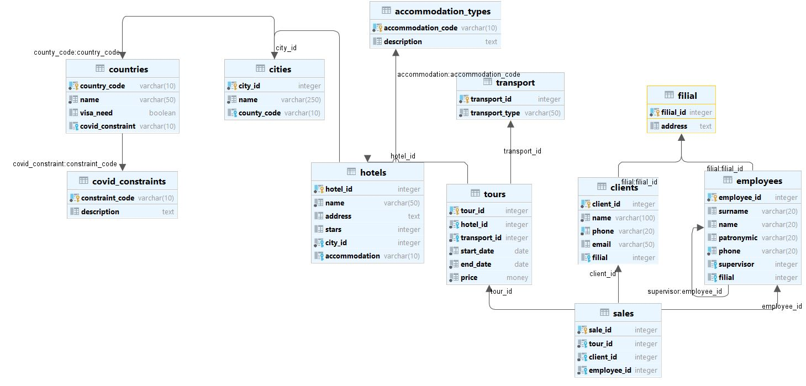

## Домашнее задание №2 (Лекция 2). Компоненты современной СУБД

----------------------

#### Текущая схема базы

#### Проводим анализ возможных запросов\отчетов\поиска данных. На каждый индекс пишем краткое описание зачем он нужен
Таблица **Clients**
- При поиске клиента вероятнее всего будет использовано поле номера телефона. 
Данная необходимость может потребоваться для быстрой связи с клиентом в различных
ситуациях. Поэтому целесообразно на это поле создать индекс.

Таблица **Employees**
- Данная таблица будет участвовать в отчетах руководителям турфирмы, которые 
получают данные из различных филиалов. Поэтому следует создать индекс на поле **filial**.

Таблица **Hotels**
- При поиске отеля ориентируются на какой-либо город (или страну). Поэтому здесь
следует создать индекс на поле **city**.

Таблицы **Tours**
- Эта таблица необходима для хранения информации о продаваемых турах. 
Поскольку клиент чаще всего ориентируется на какую-то стоимость, в этой таблице
следует создать индекс на поле **price**. Кроме того, в данному случае следует
использовать **B+ tree** индекс, поскольку при поиске будет использоваться интервал.

Таблица **Sales**
- Эта таблица будет необходима для премирования сотрудников. Поэтому следует 
создать индекс на поле **employee_id**.

На справочники **countries, cities, covid** и т.д. создание индекса 
нецелесообразно, поскольку в этих таблицах мало данных.

> 

#### Предполагаем возможную кардинальность поля
Наиболее слабая кардинальность будет у следующих полей:
- name, surname, patronymic в таблицах **employees** и **clients**;

Сильная кардинальность наблюдается у полей, имеющих уникальные значения:
- email в таблице **clients**;
- phone в таблицах **employees** и **clients**;
- идентификаторы в различных таблицах;

Остальные поля будут иметь нормальную кардинальность.

#### Думаем какие логические ограничения в БД нужно добавить. Создаем ограничения по выбранным полям
- В таблице **Tours** цена не может быть отрицательной;
    > alter table tours add constraint price_is_positive check (price > 0);
- В таблице **Tours** поле **end_date** должно быть больше **start_date**;
    > alter table tours add constraint end_greater_start check (end_date > start_date);
- В таблице **Hotels** количество звезд от 1 до 5;
    > alter table hotels add constraint stars_1_to_5 check (stars > 0 and stars <= 5);
- В таблице **Clients** поле **email** должно соответствовать регулярному выражению;
    > alter table clients add constraint email_rgx check (email ~* '^[A-Za-z0-9._%-]+@[A-Za-z0-9.-]+[.][A-Za-z]+$'));
- В таблице **Clients** и **Employees** поле **phone** должно быть уникальным;
    > alter table clients add constraint phone_unique unique (phone);
