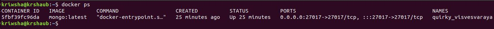
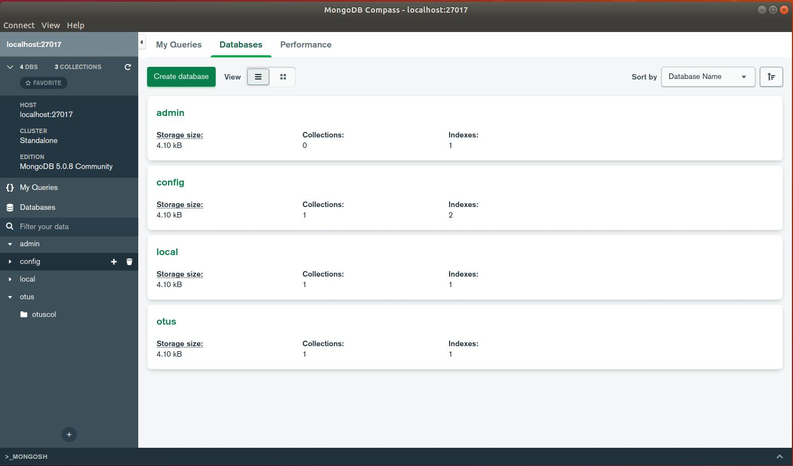
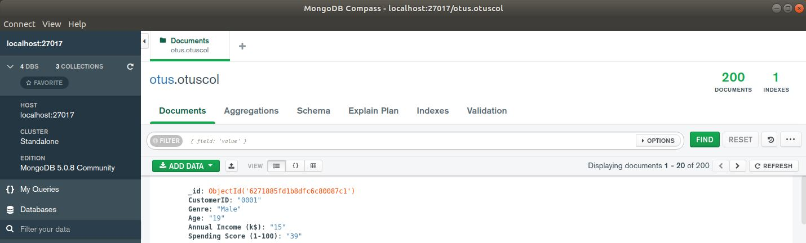
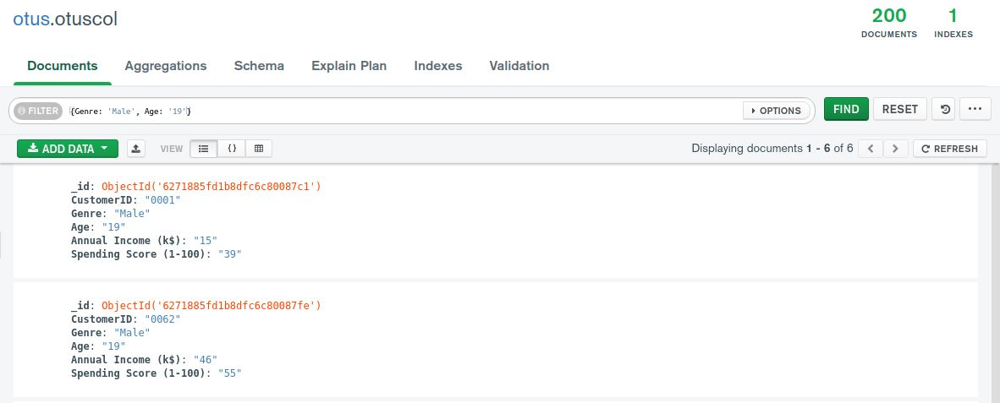
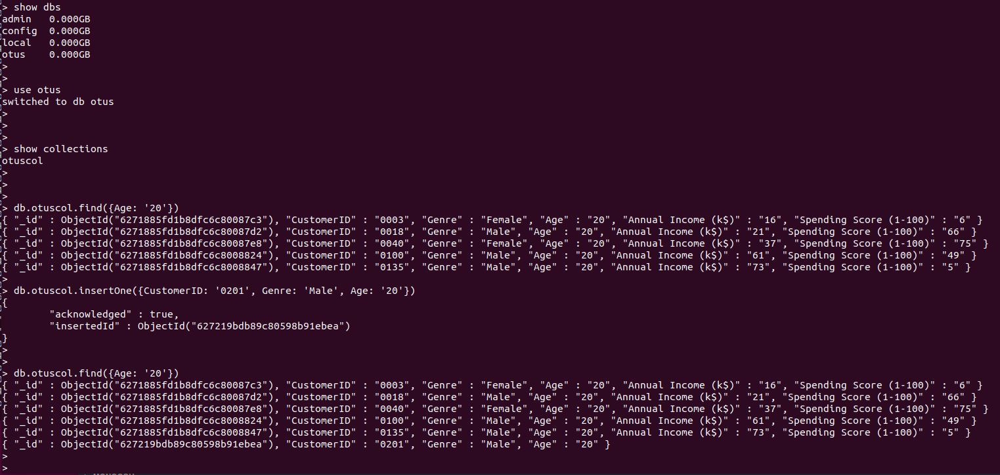
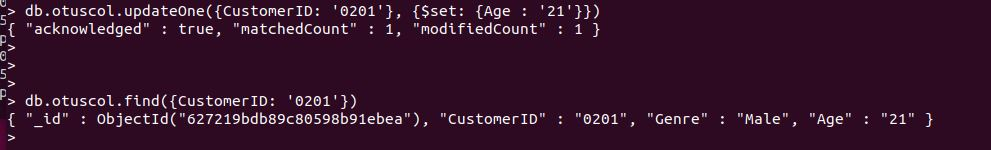

## Домашнее задание №20 (Лекция 39). Базовые возможности mongodb

-----------------------

### Цель:
В результате выполнения ДЗ вы научитесь разворачивать MongoDB, заполнять данными и делать запросы.

### Задание

Необходимо:
- установить MongoDB одним из способов: ВМ, докер;
- заполнить данными;
- написать несколько запросов на выборку и обновление данных

### Результат

1. Запущена БД MongoDB в Docker:

2. Созданы необходимые сущности (база, коллекция)

3. В коллекцию добавлены данные:

4. Выполнены запросы на выборку (с помощью Compass):

5. Выполнены запросы на выборку и добавление данных (через консоль):

6. Выполнен запрос на обновление данных:

