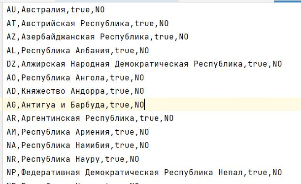
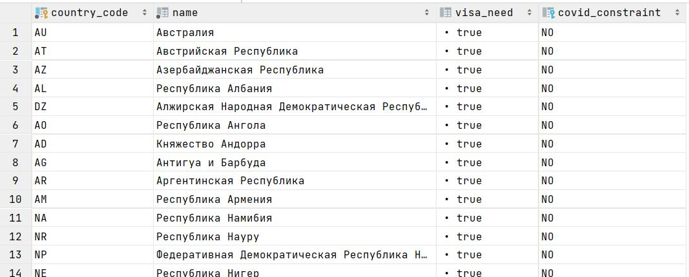

## Домашнее задание №5 (Лекция 9). DML в PostgreSQL

-----------------------

#### Цель:
- Написать запрос с конструкциями SELECT, JOIN
- Написать запрос с добавлением данных INSERT INTO
- Написать запрос с обновлением данных с UPDATE FROM
- Использовать using для оператора DELETE

#### Схема базы данных

#### 1. Напишите запрос по своей базе с регулярным выражением, добавьте пояснение, что вы хотите найти.
Запрос на выборку республик:
> SELECT * FROM countries WHERE name LIKE '%Республик%'';

#### 2. Напишите запрос по своей базе с использованием LEFT JOIN и INNER JOIN, как порядок соединений в FROM влияет на результат? Почему?
Запрос на получение данных о сотрудниках и их непосредственных руководителей
> SELECT 
> 
> e1.name as employee_name,
> 
> e1.surname as employee_surname,
> 
> e2.name as supervisor_name,
> 
> e2.surname as supervisor_surname,
> 
> FROM employees as e1
> 
> LEFT JOIN employees as e2

Запрос на получение данных о сотрудниках и их непосредственных руководителей без генерального директора
> SELECT
>
> e1.name as employee_name,
>
> e1.surname as employee_surname,
>
> e2.name as supervisor_name,
>
> e2.surname as supervisor_surname,
>
> FROM employees as e1
>
> INNER JOIN employees as e2

Два примерно одинаковых запроса, но при INNER JOIN будут выбраны сотрудники, у которых есть непосредственные руководители.
При LEFT JOIN у генерального директора руководителем будет null.

#### 3. Напишите запрос на добавление данных с выводом информации о добавленных строках.

> insert into tours (hotel_id, transport_id, start_date, end_date, price) values
> 
> (1, 1, '2021-12-22', '2021-12-26', 56000.00),
> 
> (2, 1, '2021-12-23', '2021-12-25', 32000.00),
> 
> (3, 1, '2021-12-28', '2021-12-31', 62000.00),
> 
> (3, 1, '2022-01-01', '2022-01-05', 72000.00);

#### 4. Напишите запрос с обновлением данные используя UPDATE FROM.

В рамках текущей схемы не удалось придумать подходящий пример. 

Поэтому синтетический пример. Допустим, в таблице __employees__ есть столбец, в котором хранится информация о количестве продаж (__sales_count__). Тогда можно апдейтить это значение следующим образом: 
> UPDATE employees SET sales_count = sales_count + 1 FROM sales
> WHERE accounts.name = 'Ivan Ivanov'
> AND employees.id = sales.employee_id;

#### 5. Напишите запрос для удаления данных с оператором DELETE используя join с другой таблицей с помощью using.

Также не нашел удачного примера для текущей схемы.

Синтетический пример.

> DELETE
> FROM tours T
> USING hotel H
> WHERE T.hotel_id = H.id AND
> H.city_id = (SELECT id FROM cities WHERE name = 'NY');

#### 6. Приведите пример использования утилиты COPY (по желанию)

> copy countries(country_code, name, visa_need, covid_constraint)
> 
> from '/mnt/countries.csv'
> 
> delimiter ',' csv;

[Файл со странами](../src/main/liquibase/updates/0_0/countries.csv):

После добавления:

