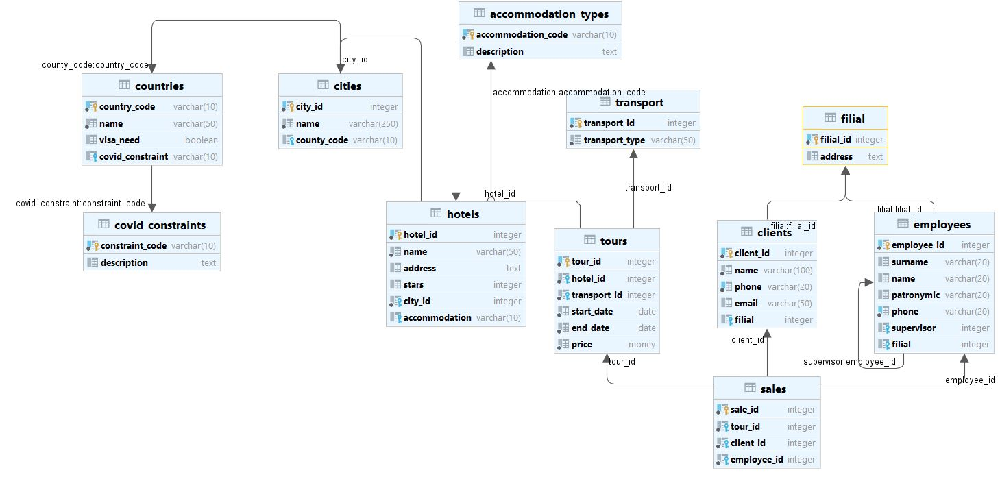

## Домашнее задание №6 (Лекция 11). Индексы PostgreSQL

-----------------------

#### Цель:
- Знать и уметь применять основные виды индексов PostgreSQL
- Построить и анализировать план выполнения запроса
- Уметь оптимизировать запросы для с использованием индексов

#### Схема базы данных

#### Задание
Создать индексы на БД, которые ускорят доступ к данным.
В данном задании тренируются навыки:
- определения узких мест
- написания запросов для создания индекса
- оптимизации 

#### Необходимо:
#### 1. Создать индекс к какой-либо из таблиц вашей БД
#### 2. Прислать текстом результат команды explain, в которой используется данный индекс
#### 3. Реализовать индекс для полнотекстового поиска
#### 4. Реализовать индекс на часть таблицы или индекс на поле с функцией
#### 5. Создать индекс на несколько полей
#### 6. Написать комментарии к каждому из индексов
#### 7. Описать что и как делали и с какими проблемами столкнулись