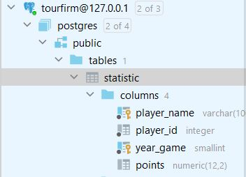
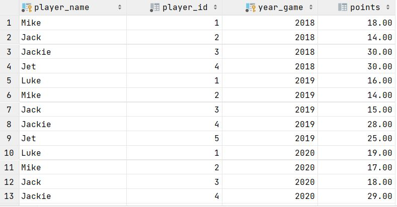
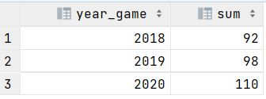
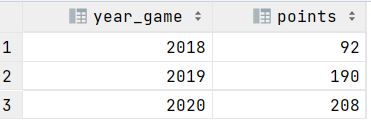

## Домашнее задание №7 (Лекция 12). DML: агрегация и сортировка, CTE, аналитические функции

-----------------------

#### Цель:
Научиться использовать функцию LAG и CTE

#### Задание

#### 1. Создайте таблицу и наполните ее данными CREATE TABLE statistic( player_name VARCHAR(100) NOT NULL, player_id INT NOT NULL, year_game SMALLINT NOT NULL CHECK (year_game > 0), points DECIMAL(12,2) CHECK (points >= 0), PRIMARY KEY (player_name,year_game) );

#### 2. заполнить данными INSERT INTO statistic(player_name, player_id, year_game, points) VALUES ('Mike',1,2018,18), ('Jack',2,2018,14), ('Jackie',3,2018,30), ('Jet',4,2018,30), ('Luke',1,2019,16), ('Mike',2,2019,14), ('Jack',3,2019,15), ('Jackie',4,2019,28), ('Jet',5,2019,25), ('Luke',1,2020,19), ('Mike',2,2020,17), ('Jack',3,2020,18), ('Jackie',4,2020,29), ('Jet',5,2020,27);

#### 3. написать запрос суммы очков с группировкой и сортировкой по годам
Запрос:
> SELECT year_game, sum(points)
> 
> FROM statistic
> 
> GROUP BY year_game
> 
> ORDER BY year_game

Результат:

#### 4. написать cte показывающее то же самое
Запрос:
> WITH t AS (SELECT year_game, sum(points)
>
> FROM statistic
>
> GROUP BY year_game
>
> ORDER BY year_game)
> 
> SELECT * FROM t;

#### 5. используя функцию LAG вывести кол-во очков по всем игрокам за текущий код и за предыдущий.
> with
> 
> t1 as (
> 
> select year_game, sum(points) as sum_points
> 
> from statistic
> 
> group by year_game
> 
> order by year_game
> 
> )
> 
> , t2 as (
> 
> select year_game,
> 
> sum_points,
> 
> coalesce( lag(sum_points) over (order by year_game), 0) as prev_sum_points
> 
> from t1
> 
> group by year_game, sum_points
> 
> order by year_game
> 
> )
> 
> select t2.year_game, t2.sum_points + t2.prev_sum_points as points
> 
> from t2;

Результат:

